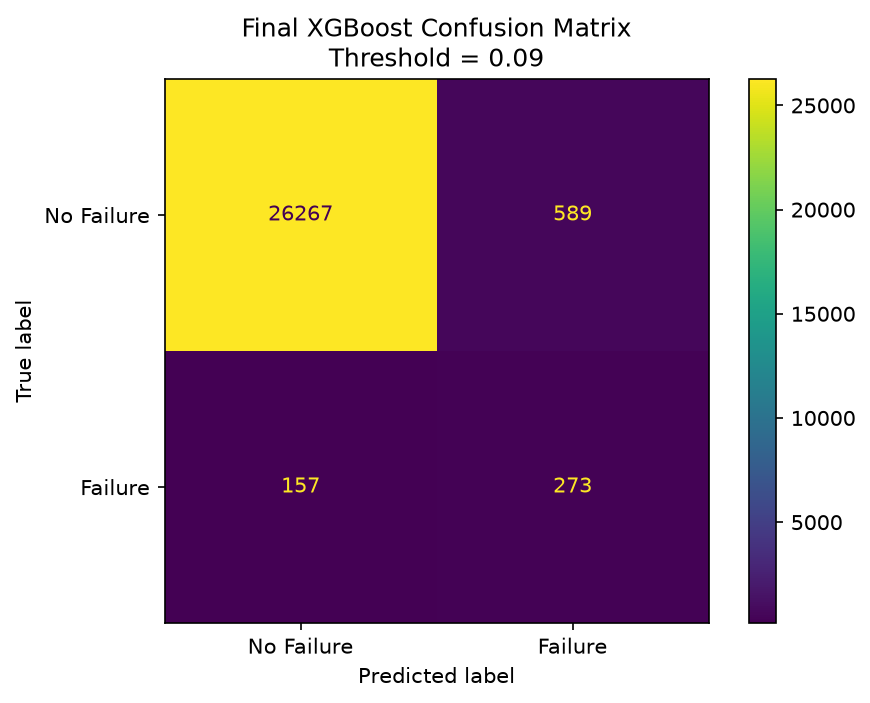
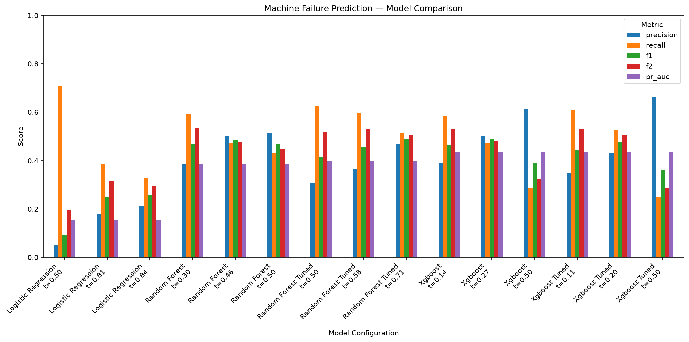
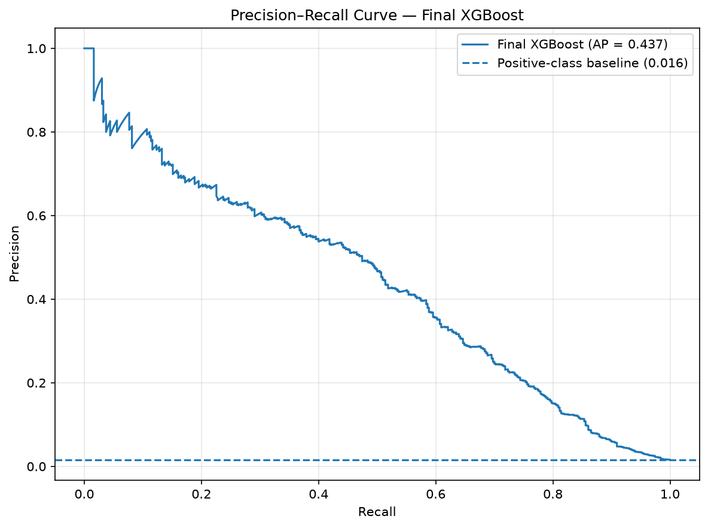
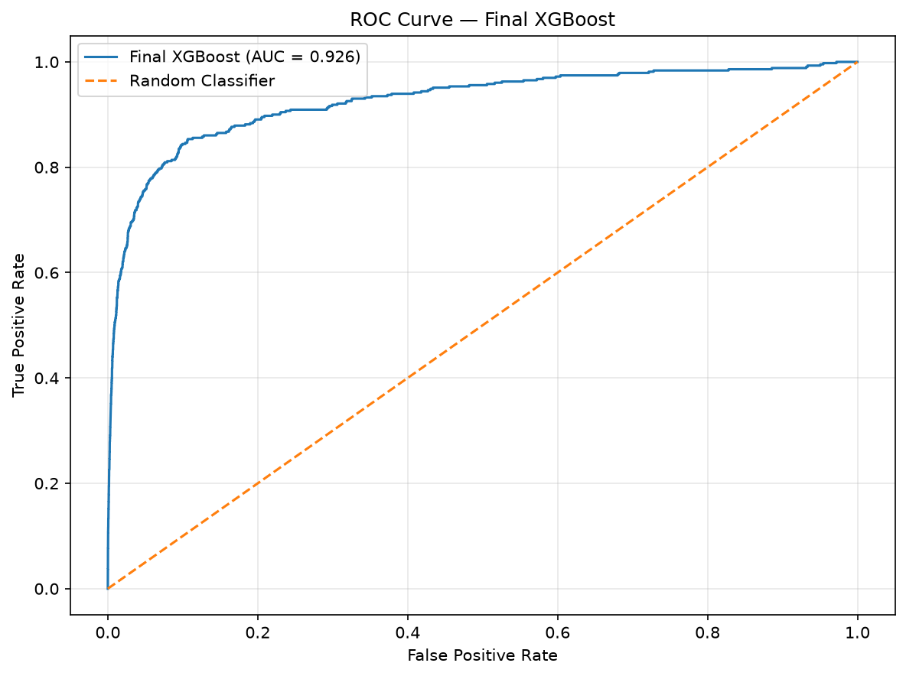
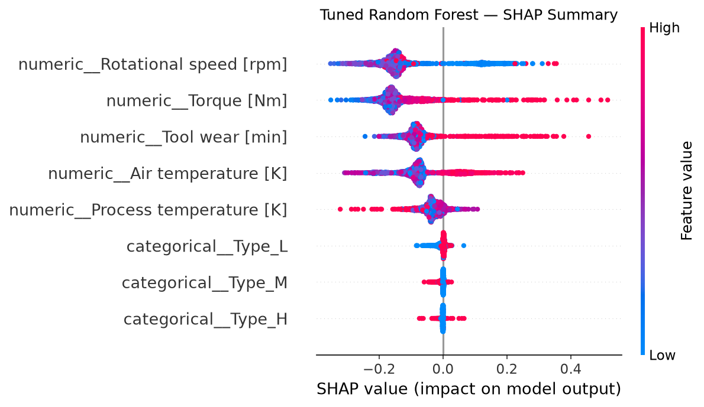

# Machine Failure Prediction

End-to-end machine learning project for predicting machine failures from operational sensor data.

The goal is to identify machines at risk of failure using measurements such as temperature, rotational speed, torque, tool wear, and machine type.

A key challenge is the strong class imbalance: machine failures represent only about **1.6%** of the observations. Because of this, the project focuses on metrics such as **Recall, F1, F2, ROC-AUC, and PR-AUC**, rather than relying on accuracy alone.

## Final Results

The final selected model is **XGBoost** with a decision threshold of **0.09**, selected on the validation set with an emphasis on F2-score and failure detection.

| Metric | Final Test Score |
|---|---:|
| Accuracy | 0.9727 |
| Precision | 0.3167 |
| Recall | **0.6349** |
| F1 | 0.4226 |
| F2 | **0.5287** |
| ROC-AUC | **0.9261** |
| PR-AUC | **0.4374** |

The final model detected approximately **63.5% of machine failures** on the previously untouched test set.



## Problem Statement

Unexpected machine failures can result in production downtime, maintenance costs, and operational disruption.

The objective is to predict whether a machine is likely to fail based on its current operating conditions.

This is formulated as a binary classification problem:

- `0` — No machine failure
- `1` — Machine failure

Because failures are rare, simply maximizing accuracy would be misleading. A classifier predicting "No Failure" almost everywhere could achieve very high accuracy while failing to identify actual failures.

In this problem, missing a real machine failure may be more costly than generating an additional maintenance alert. Therefore, **Recall** and **F2-score** play an important role in model and threshold selection.

## Dataset

The dataset contains **136,429 machine-operation observations**.

The main model features are:

- Air temperature [K]
- Process temperature [K]
- Rotational speed [rpm]
- Torque [Nm]
- Tool wear [min]
- Machine type

The target variable is:

- `Machine failure`

### Class Distribution

The dataset is highly imbalanced:

- No failure: approximately **98.4%**
- Machine failure: approximately **1.6%**

This imbalance influenced both the evaluation strategy and the final decision-threshold selection.

> The raw dataset is not stored in the repository. Place it at `data/raw/train.csv` before running the training pipeline.

## Machine Learning Workflow

The project implements an end-to-end workflow:

1. Exploratory data analysis
2. Data validation and feature preparation
3. Numerical and categorical preprocessing
4. Baseline model training
5. Model comparison
6. Hyperparameter tuning
7. Train / validation / test separation
8. Decision-threshold optimization
9. Final model refitting
10. Evaluation on a reserved test set
11. Feature importance and permutation importance
12. SHAP-based explainability
13. Automated testing and code-quality checks

## Exploratory Data Analysis

Exploratory analysis was performed before model development to understand:

- Dataset structure
- Missing values
- Feature distributions
- Class imbalance
- Correlations between numeric variables
- Relationships between operating conditions and machine failures

The analysis indicated that several operating measurements contain useful predictive information.

Subsequent model-explainability analysis highlighted variables such as:

- Torque
- Rotational speed
- Air temperature
- Process temperature
- Tool wear

The results also suggest that machine failure risk depends on combinations of operating conditions rather than a single isolated measurement.

## Data Preprocessing

The dataset contains both numerical and categorical features.

### Numerical Features

The numerical features are:

- Air temperature [K]
- Process temperature [K]
- Rotational speed [rpm]
- Torque [Nm]
- Tool wear [min]

Missing numerical values are handled using **median imputation**, followed by standardization using `StandardScaler`.

### Categorical Features

Machine type is treated as a categorical variable.

Missing values are handled using the most frequent category, followed by one-hot encoding.

### Scikit-learn Pipeline

Preprocessing and classification are combined in a Scikit-learn `Pipeline`.

This ensures that the same preprocessing operations are applied consistently during training and prediction while reducing the risk of data leakage.

## Models

Three main classification algorithms were investigated.

### Logistic Regression

Logistic Regression was used as an interpretable baseline.

Because machine failures are strongly underrepresented, class weighting was used to give greater importance to the minority class.

The model provided a useful baseline but showed weaker ranking performance than the tree-based models.

### Random Forest

Random Forest was evaluated as a nonlinear ensemble model capable of capturing more complex relationships between operating conditions.

Both baseline and hyperparameter-tuned configurations were evaluated.

Random Forest substantially improved ROC-AUC and PR-AUC compared with Logistic Regression and also enabled feature-importance analysis.

### XGBoost

XGBoost was evaluated as a gradient-boosted tree model.

Both baseline and tuned configurations were tested.

XGBoost achieved the strongest overall ranking performance and was therefore selected for the final validation-based workflow.

## Model Comparison

| Model | ROC-AUC | PR-AUC |
|---|---:|---:|
| Logistic Regression | 0.8175 | 0.1535 |
| Random Forest | 0.9153 | 0.3882 |
| Tuned Random Forest | 0.9234 | 0.3991 |
| **XGBoost** | **0.9261** | **0.4374** |
| Tuned XGBoost | 0.9250 | 0.4369 |



An important result was that hyperparameter tuning did **not automatically improve performance**.

The tuned XGBoost configuration performed similarly to, but slightly below, the baseline XGBoost model in ROC-AUC and PR-AUC. This demonstrates the importance of empirical validation rather than assuming a tuned model must be better.

## Evaluation Metrics

Because the problem is highly imbalanced, several complementary metrics were used:

- **Precision** — proportion of predicted failures that were actual failures.
- **Recall** — proportion of actual failures successfully detected.
- **F1-score** — harmonic mean of precision and recall.
- **F2-score** — weighted harmonic mean that gives greater importance to recall.
- **ROC-AUC** — ability to rank positive examples above negative examples across thresholds.
- **PR-AUC** — precision-recall performance, particularly useful for imbalanced classification.

Recall is particularly important because a false negative represents a machine failure that the model failed to detect.

## Validation Strategy

To prevent the final test set from influencing model-selection decisions, the dataset was divided into:

- **Training:** approximately 64%
- **Validation:** approximately 16%
- **Test:** approximately 20%

The training set was used to fit models.

The validation set was used for model-selection decisions and decision-threshold optimization.

The test set remained reserved throughout this process.

After selecting the final model and locking the decision threshold, the model was refitted using the combined training and validation data, representing approximately **80%** of the full dataset.

The reserved **20% test set** was then used once for final evaluation.

## Decision Threshold Optimization

Binary classifiers commonly use a probability threshold of `0.50`.

For this highly imbalanced problem, however, the default threshold produced relatively high precision while missing many actual failures.

Decision thresholds were therefore evaluated using:

- Precision
- Recall
- F1
- F2

The final threshold was selected **using validation data only**.

For XGBoost, the selected validation threshold was:

| Metric | Validation Result |
|---|---:|
| Threshold | **0.09** |
| Precision | 0.3425 |
| Recall | **0.6512** |
| F1 | 0.4489 |
| F2 | **0.5517** |

A threshold of `0.09` was selected because the project prioritizes detecting machine failures while maintaining a meaningful level of precision.

## Final Model Evaluation

After model and threshold selection, XGBoost was refitted using the combined training and validation data.

The reserved test set was then evaluated once using the locked threshold of `0.09`.

### Confusion Matrix


### Precision-Recall Curve



### ROC Curve



### Final Test Metrics

| Metric | Score |
|---|---:|
| Accuracy | 0.9727 |
| Precision | 0.3167 |
| Recall | **0.6349** |
| F1 | 0.4226 |
| F2 | **0.5287** |
| ROC-AUC | **0.9261** |
| PR-AUC | **0.4374** |

The final model successfully identified approximately **63.5% of machine failures** in previously untouched test data.

## Model Explainability

Predictive performance alone does not explain why a model produces a particular prediction.

Several complementary explainability techniques were therefore investigated:

- Random Forest feature importance
- Permutation importance
- SHAP values
- SHAP dependence analysis
- Interaction analysis

### Random Forest Feature Importance

| Feature | Importance |
|---|---:|
| Rotational speed | 0.3297 |
| Torque | 0.2842 |
| Tool wear | 0.1745 |
| Air temperature | 0.1223 |
| Process temperature | 0.0783 |

Machine type contributed substantially less than the main continuous operating measurements.

### Permutation Importance

Permutation importance was calculated on held-out data using average precision as the scoring metric.

| Feature | Mean Importance |
|---|---:|
| Air temperature | 0.2181 |
| Torque | 0.2110 |
| Rotational speed | 0.2062 |
| Process temperature | 0.0981 |
| Tool wear | 0.0881 |
| Machine type | 0.0133 |

Although the ranking differs from the model's built-in feature importance, both methods indicate that numerical operating conditions contain substantially more predictive information than machine type.

### SHAP Analysis

SHAP was used to investigate how individual feature values influence model predictions.

The analysis showed that important feature effects are nonlinear. A feature cannot necessarily be summarized as simply "higher means more risk" or "lower means less risk."

Torque and rotational speed showed particularly important patterns.



The relationship between torque and rotational speed also suggested that the impact of one operating variable may depend on the operating regime of another.

This supports a key conclusion of the project: **machine failure risk is associated with combinations of operating conditions rather than a single isolated measurement.**

## Project Structure

```text
machine-failure-prediction/
│
├── data/
│   ├── raw/
│   │   └── .gitkeep
│   ├── interim/
│   │   └── .gitkeep
│   └── processed/
│       └── .gitkeep
│
├── models/
│   └── .gitkeep
│
├── notebooks/
│   └── archive/
│       └── original_notebook.ipynb
│
├── reports/
│   ├── figures/
│   │   ├── model_comparison.png
│   │   ├── random_forest_tuned_shap_summary.png
│   │   ├── xgboost_final_confusion_matrix_threshold_009.png
│   │   ├── xgboost_final_precision_recall_curve.png
│   │   └── xgboost_final_roc_curve.png
│   ├── metrics/
│   └── tables/
│       └── model_comparison.csv
│
├── src/
│   └── machine_failure/
│       ├── __init__.py
│       ├── comparison.py
│       ├── data.py
│       ├── eda.py
│       ├── evaluate.py
│       ├── explainability.py
│       ├── features.py
│       ├── model.py
│       ├── preprocessing.py
│       ├── reporting.py
│       ├── shap_analysis.py
│       ├── threshold.py
│       ├── train.py
│       └── tuning.py
│
├── tests/
│   ├── test_data.py
│   ├── test_evaluate.py
│   ├── test_features.py
│   ├── test_model.py
│   ├── test_preprocessing.py
│   ├── test_reporting.py
│   ├── test_threshold.py
│   └── test_train.py
│
├── .gitignore
├── pyproject.toml
├── README.md
└── uv.lock
```

Raw datasets, generated model artifacts, and most generated reports are intentionally excluded from version control.

## Installation

The project uses `uv` for Python dependency and environment management.

### 1. Clone the Repository

```bash
git clone <repository-url>
cd machine-failure-prediction
```

### 2. Install Dependencies

```bash
uv sync
```

This creates the virtual environment and installs the dependency versions defined by the project and lock file.

### 3. Add the Dataset

Place the dataset at:

```text
data/raw/train.csv
```

## Usage

### Exploratory Data Analysis

```bash
uv run python -m machine_failure.eda
```

### Train the Final Model

```bash
uv run python -m machine_failure.train
```

### Evaluate the Model

```bash
uv run python -m machine_failure.evaluate
```

### Threshold Analysis

```bash
uv run python -m machine_failure.threshold
```

### Hyperparameter Tuning

```bash
uv run python -m machine_failure.tuning
```

### Model Comparison

```bash
uv run python -m machine_failure.comparison
```

### Feature Importance

```bash
uv run python -m machine_failure.explainability
```

### SHAP Analysis

```bash
uv run python -m machine_failure.shap_analysis
```

## Testing and Code Quality

The project includes automated tests covering:

- Data loading and validation
- Feature preparation
- Preprocessing
- Model construction
- Model evaluation
- Reporting utilities
- Threshold analysis
- Training utilities

### Run Tests

```bash
uv run pytest -v
```

### Run Tests with Coverage

```bash
uv run pytest --cov=machine_failure --cov-report=term-missing
```

### Run Ruff

```bash
uv run ruff check src tests
```

## Technology Stack

- Python 3.12
- pandas
- NumPy
- Scikit-learn
- XGBoost
- SHAP
- Matplotlib
- Seaborn
- Joblib
- pytest
- pytest-cov
- Ruff
- uv

## Key Takeaways

- Accuracy alone is misleading when machine failures represent only a small fraction of observations.
- Tree-based ensemble models substantially outperformed the Logistic Regression baseline.
- XGBoost achieved the strongest overall ROC-AUC and PR-AUC performance.
- Hyperparameter tuning did not automatically improve model performance.
- Validation-based decision-threshold optimization substantially improved failure detection compared with the default threshold of `0.50`.
- A threshold of `0.09` was selected with an emphasis on F2-score and recall.
- The final model detected approximately **63.5% of machine failures** on the previously untouched test set.
- Explainability analysis showed that torque, rotational speed, temperature, and tool wear contain important predictive information.
- Feature effects are nonlinear, and failure risk depends on combinations of operating conditions.
- Separating training, validation, and test data prevents the final test set from influencing model-selection decisions.

## Reproducibility

Dependencies are managed using `uv`, with configuration stored in `pyproject.toml` and reproducible dependency versions recorded in `uv.lock`.

The final test set is kept separate from model and threshold selection to provide a more reliable estimate of generalization performance.